# CodeStar - Ruby Lambda API Example

## Local Setup

A local setup isn't necessary for this tutorial, but it can be helpful for development purposes. The `sam` tool will allow you to run and test code locally.

```
$ brew tap aws/tap
$ brew install rbenv aws-sam-cli
$ rbenv init
$ rbenv install 2.7.1
$ rbenv local 2.7.1
```

Start the local service with

```
$ sam local start-api -p 8080
```

## CodeStar Setup

AWS provides many CodeStart templates, but in our case there is no Ruby web service template given. We can create one with slight modifications to the Python template.

### Create a CodeStar Web Service, Lambda Template

Create a new project, and choose "Web service" and "AWS Lambda" from the filter list to find the Python template.

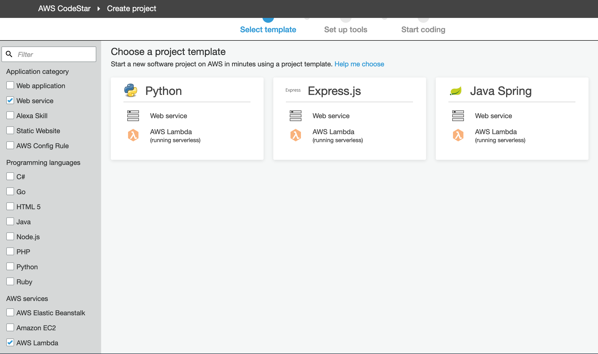

Next, select the CodeCommit option for the source code. By default, CodeStar creates a new repository, so since we have an existing repository in Github, we'll create a dummy repo and replace it later.

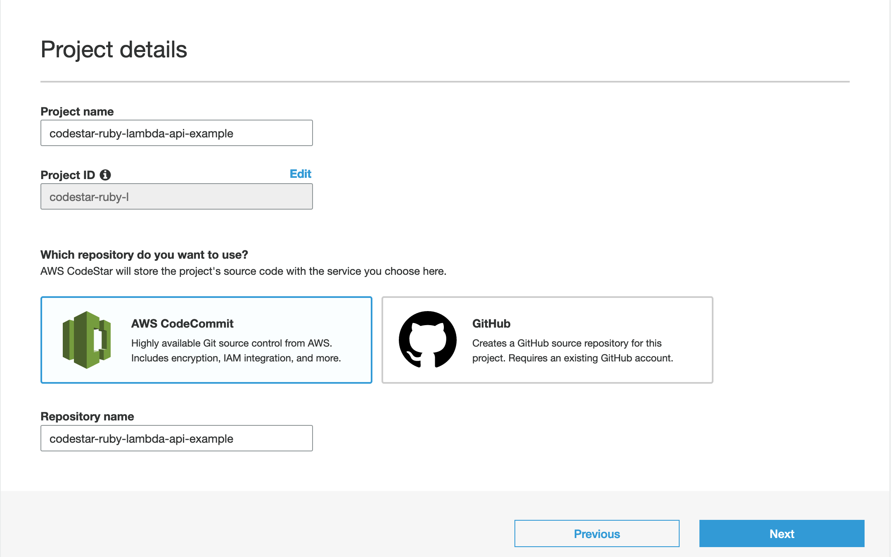

Wait for the project to create it's initial build.

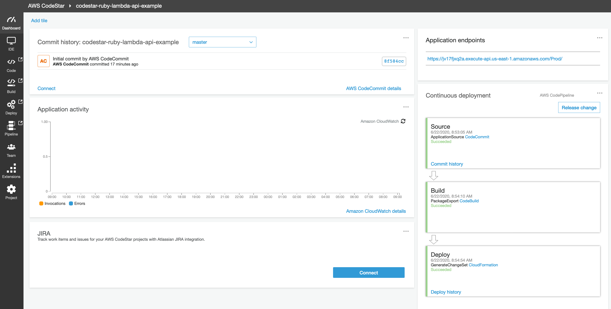

### Edit CodePipeline Source Repository

Find the CodePipleline representing the CD workflow. Click to edit the pipeline...

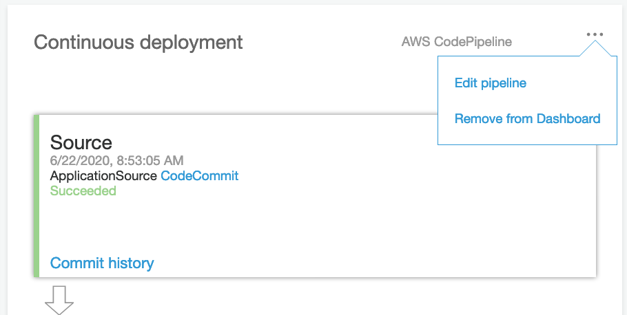

...edit the "source" stage...

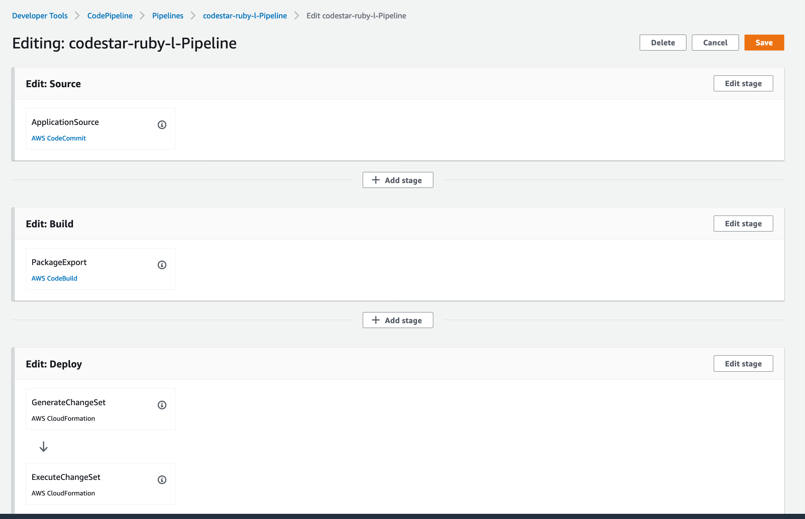

...and edit the source action...

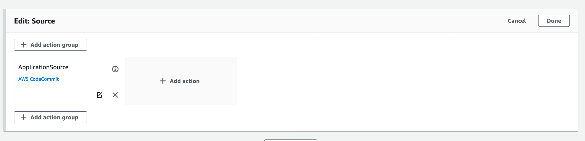

...switching the repo from CodeCommit to Github. We can now select our existing repository after authenticating with Github.

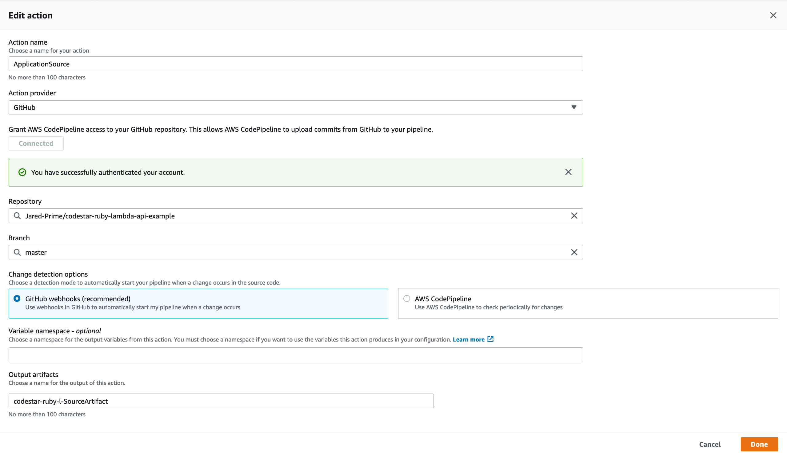

Save, and trigger a redeployment from the updated source code.

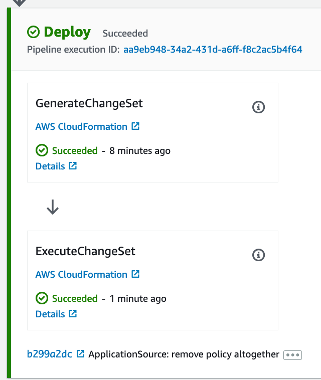

### Edit IAM Permissions Boundary and Policy

If you noticed, the template from the initial setup did not contain a DynamoDB resource, whereas the `template.yml` in our setup does. This demo will successfully create a DynamoDB table; to use it in our lambda function, we'll need to take a pair of manual steps.

#### Edit Permissions Boundary

Navigate to CloudFormation and find the stack matching the CodeStar project name. You should see two:

  - my-code-star-project-infrastructure
  - my-code-star-project

The second, earlier stack `my-code-star-project` is the _base stack_. Go to this one first, and enter the resources tab.

Find the PermissionsBoundaryPolicy, and click on the ID link.

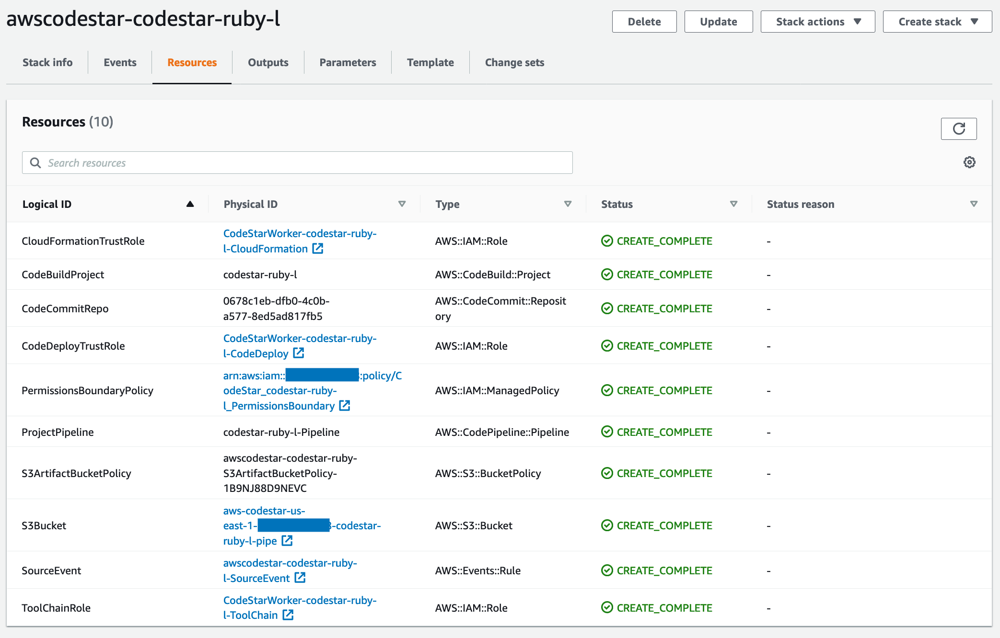

From the IAM view, click on "Edit Policy" and then "Add additional permissions". We'll create a DynamoDB permissions for select Read and Write actions on all resources. Save the policy.

#### Edit Lambda Execcution Role

Return to CloudFormation, and now enter the second stack, `my-code-star-project-infrastructure`.

Find the LambdaExecutionRole, and click on the ID link.

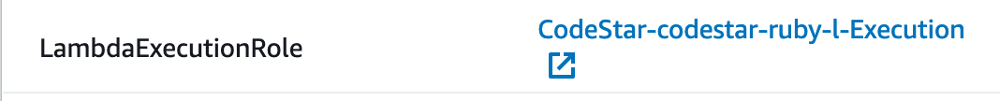

Now, choose "Add inline policy". We'll create a DynamoDB permissions for select Read and Write actions, *but* we'll make this for specific resources. Supply the DynamoDB table name that was generated by the CloudFormation stack template.

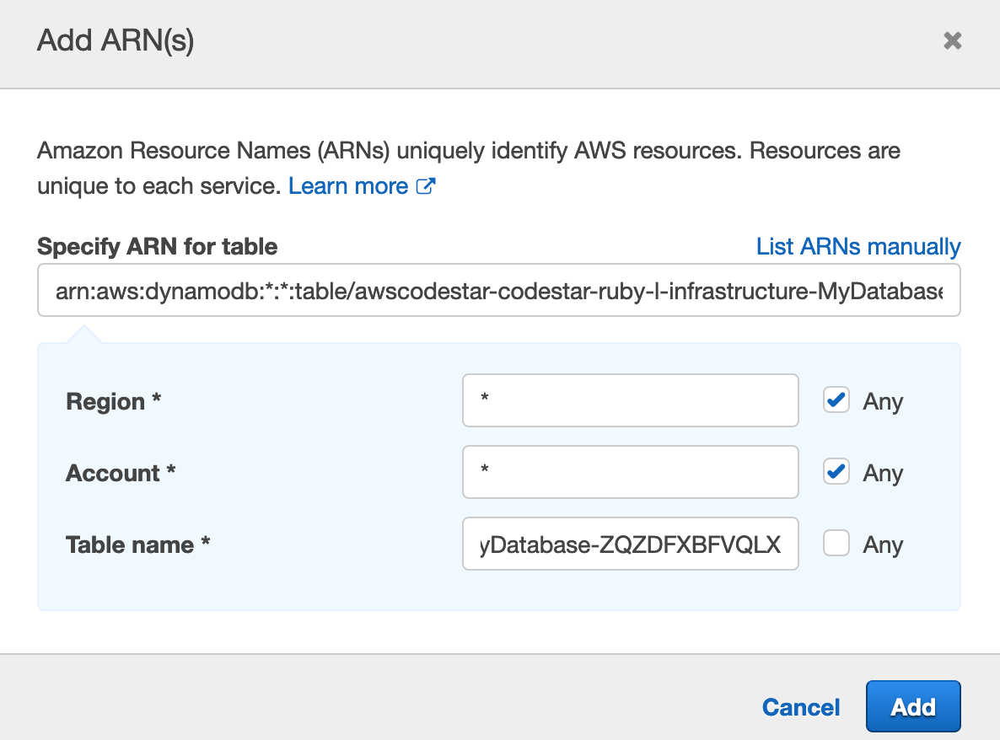

Save this, then navigate to the Lambda function to confirm.

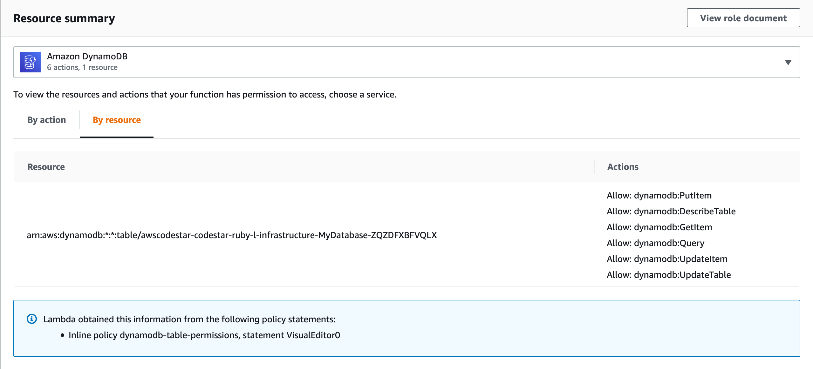

#### Why the manual steps?

A permissions boundary specifies the maximum permissions allowed on resources. When CodeStar created a project for us, the permissions boundary did not include DynamoDB, and therefore we could not exapand the lambda function's permissions to have read/write access to any DynamoDB tables -- even ones we create in the `template.yml` during the deployment.

This is a necessary limitation of CodeStar, as it simply provides a set of standard templates for a full CI/CD experience without worrying about CloudFormation. If we want something outside that experience, then we need to drop down to the templates.